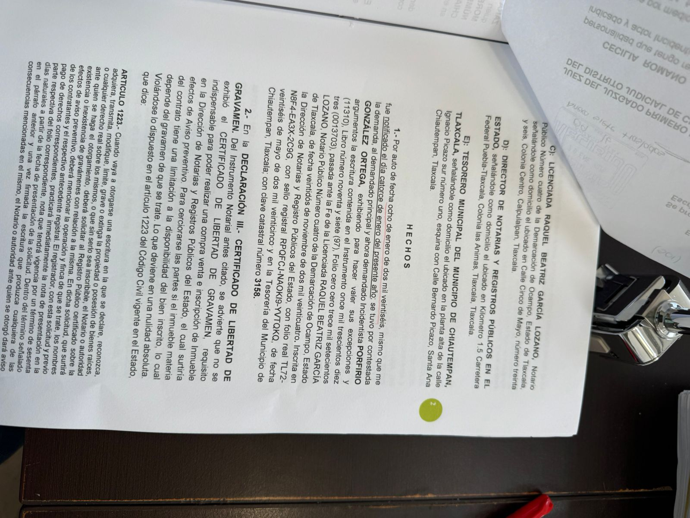
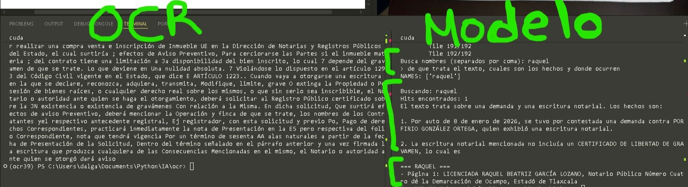

EN VERSIONES FUTURAS SE DESPLEGARA EN LA WEB
=======
# Pipeline de OCR, limpieza y análisis de PDFs

Este proyecto es un **pipeline completo para extraer, limpiar, analizar y consultar información de PDFs**, especialmente documentos escaneados (jurídicos, administrativos, etc.), combinando:

* Texto embebido en el PDF
* Mejora de imagenes con GAN's (RealESRGAN y DE-GAN) combinadas
* OCR avanzado con preprocesamiento pesado
* Búsqueda difusa de nombres
* Agrupación por página
* Consulta semántica con LLM (HuggingFace) [Qwen 7B]

---
<p align="center">
  
  
</p>

<p align="center">
  <em>Antes y Depues de pasar la imagen por el modelo GAN</em>
  <p align="center">(Extrae la imgaen del PDF escaneado y la pone en la memoria RAM)</p>
</p>

---
<h3 align="center">RESULTADOS</h3>

<p align="center">
  
</p>
---
##  Descripción de cada archivo

### `clear.py`

**Preprocesamiento de imágenes para OCR**

Hace:

* Denoise
* Escala de grises
* Normalización
* Super-resolución con **RealESRGAN**
* Binarización adaptativa
* Refinado de bordes

Función principal:

```python
ganear(img_np_rgb) -> np.ndarray
```

Devuelve una imagen optimizada (grayscale) lista para OCR.

**Requisitos clave**:

* PyTorch (CPU o GPU)
* Modelo `RealESRGAN_x4plus.pth` en el link de Drive
[RealESRGAN_x4plus.pth]:**https://drive.google.com/file/d/1EBoYFP530nd5zelUyODPITyOjtIoWvje/view?usp=sharing**

---

### `ocr_img.py`

**OCR y limpieza de texto**

Responsabilidades:

* Corrección de inclinación (deskew)
* Detección de orientación (Tesseract OSD)
* OCR en español
* Limpieza agresiva:

  * Ruido
  * Errores 0/O, l/1
  * Letras separadas
  * Saltos de línea basura

Función clave:

```python
ocr_clean(image_np_rgb) -> str
```

Aquí se arregla el texto par el OCR

---

### `pdf.py`

**Extracción y análisis del PDF**

Este archivo es el **cerebro del pipeline**.

Incluye:

* Extracción de texto nativo
* OCR de páginas con imágenes
* Unificación en bloques
* Búsqueda difusa de nombres
* Agrupación por página
* Construcción de contexto

Funciones importantes:

```python
build_pages(pdf_path)
find_mentions(pages, name, threshold)
group_by_page(hits)
build_context(grouped_hits)
```

Salida final: texto limpio, organizado y listo para análisis semántico.

---

### `nmo.py`

**Script principal de interacción con LLM**

Hace lo siguiente:

1. Carga el PDF procesado
2. Busca nombres (fuzzy match)
3. Extrae contexto local
4. Consulta un LLM (HuggingFace)
5. Intenta inferir roles, cargos o descripciones

Usa el modelo:

```
Qwen/Qwen2.5-7B-Instruct
```

Este script **sí ejecuta el pipeline completo**.

---

##  Ejecución

1. Coloca tu PDF en `./pdfs/`
2. Ajusta el path en `nmo.py`
3. Agrega tu token de HuggingFace
4. Ejecuta:

```bash
python nmo.py
```

Entrada esperada:

* Lista de nombres (separados por coma)
* Pregunta a responder usando el texto

---

##  Dependencias principales

```bash
pip install -r requirements.txt
```

Además necesitas:

* Tesseract instalado en el sistema
* Idioma español (`spa.traineddata`)

---

## Notas importantes

* Esto **consume RAM y CPU/GPU** minimo (2060 6 GiB - 16GB RAM)
* PDFs grandes o muy escaneados tardan
* El OCR no es perfecto, solo menos peor
* El LLM **NO debe inventar**, el prompt lo restringe

---

##  Uso recomendado

* Documentos jurídicos
* Expedientes escaneados
* PDFs mixtos (texto + imagen)
* Extracción de roles, menciones y evidencia textual

---

(actualizacion v.30.1.26)
